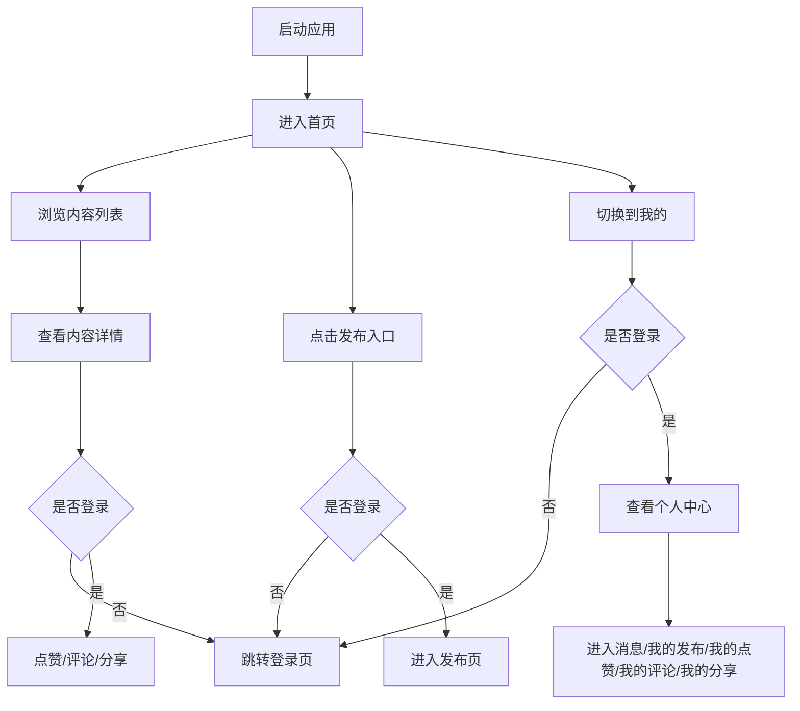

## 1. 产品概述
即闪用户端是一个基于 `uni-app + Vue3 + TypeScript + Vite` 的内容互动前端，面向 H5 与小程序端，提供内容浏览、发布、互动与个人中心能力。
- 当前阶段以“快速搭建可演示骨架”为目标，先使用死数据完成页面展示与主流程串联，再逐步替换为真实接口。
- 产品核心价值是以轻量、直观的方式承载内容发布、点赞评论、消息触达与个人资产管理。

## 2. 核心功能

### 2.1 用户角色
| 角色 | 接入方式 | 核心权限 |
|------|----------|----------|
| 游客 | 直接访问 | 浏览首页列表、查看内容详情、查看协议页面 |
| 登录用户 | 小程序端微信登录 / H5 预留登录能力 | 发布内容、编辑/删除本人内容、点赞、评论、分享、查看消息、管理个人资料 |

### 2.2 功能模块
1. **首页**：内容流、卡片展示、点赞/评论入口、跳转详情。
2. **内容详情页**：详情内容、图片展示、互动区、作者权限展示。
3. **发布/编辑页**：内容输入、图片管理、提交发布、编辑已有内容。
4. **登录与绑定**：微信登录、手机号绑定、登录态提示。
5. **个人中心**：用户资料、功能入口、消息入口、我的发布/点赞/评论/分享。
6. **消息列表**：系统消息、互动消息、未读标识。
7. **资料与协议**：编辑资料、隐私协议、用户协议。

### 2.3 页面明细
| 页面名称 | 模块名称 | 功能说明 |
|-----------|-----------|-----------|
| 首页 | 顶部品牌区 | 展示项目名、页面说明、发布快捷入口 |
| 首页 | 内容列表 | 展示 `PostItem` 卡片、图片、互动统计、作者信息 |
| 首页 | 列表筛选占位 | 预留推荐/最新切换与搜索入口 |
| 内容详情页 | 详情头部 | 展示作者、发布时间、是否本人、可编辑/可删除状态 |
| 内容详情页 | 正文与图片 | 展示内容文本、图片宫格、分享入口 |
| 内容详情页 | 评论区 | 展示评论列表、回复入口、发表评论入口 |
| 登录页 | 登录说明 | 说明微信登录流程与用户收益 |
| 登录页 | 登录按钮 | 小程序端触发 `uni.login`，H5 端展示占位说明 |
| 发布页 | 编辑表单 | 输入正文、管理图片、提交按钮 |
| 内容编辑页 | 编辑表单 | 加载已有内容并编辑提交 |
| 个人中心 | 用户卡片 | 展示头像、昵称、简介、手机号绑定状态 |
| 个人中心 | 功能入口 | 跳转我的发布、我的点赞、我的评论、我的分享、消息列表 |
| 我的发布 | 列表区 | 仅展示当前登录用户内容 |
| 我的点赞 | 列表区 | 展示当前登录用户点赞过的内容 |
| 我的评论 | 列表区 | 展示当前登录用户评论过的内容 |
| 我的分享 | 列表区 | 展示当前登录用户分享过的内容 |
| 编辑资料页 | 表单区 | 修改头像、昵称、简介 |
| 绑定手机号页 | 表单区 | 输入手机号、验证码、完成绑定 |
| 消息列表 | 消息流 | 展示互动消息、系统消息、时间与未读状态 |
| 隐私协议 | 文本区 | 展示隐私协议内容 |
| 用户协议 | 文本区 | 展示用户协议内容 |

## 3. 核心流程
游客默认进入首页，可浏览内容与详情；需要互动或进入个人能力时，引导登录。登录用户可在首页浏览、点赞、评论、分享，也可从个人中心进入消息、内容管理与资料设置。当前首版采用 2 个 Tab：`首页`、`我的`，消息列表从个人中心入口进入。

## 4. 用户界面设计
### 4.1 设计风格
- 主色调：高亮橙红作为品牌强调色，搭配深色文字与浅暖灰背景。
- 辅助色：墨黑、雾灰、柔和蓝灰用于信息层级与状态表达。
- 按钮风格：大圆角、轻拟物阴影、强调主操作渐变按钮。
- 字体风格：系统中文字体优先，标题偏粗，正文中等字重，强调移动端可读性。
- 布局风格：移动优先卡片流布局，信息分层清晰，个人中心采用分区菜单。
- 图标风格：简洁线性图标，强调点赞、评论、分享、消息等高频动作。

### 4.2 页面设计概览
| 页面名称 | 模块名称 | UI 元素 |
|-----------|-----------|-----------|
| 首页 | 顶部品牌区 | 渐变标题、轻背景插画感块面、主操作按钮 |
| 首页 | 内容卡片 | 圆角卡片、作者头像、图片宫格、互动栏、阴影悬浮感 |
| 内容详情页 | 详情展示 | 大标题、正文段落、图片轮播/宫格、底部操作条 |
| 登录页 | 登录引导 | 品牌说明区、权益说明卡、主登录按钮 |
| 发布/编辑页 | 内容表单 | 多行输入框、上传占位块、底部提交按钮 |
| 个人中心 | 用户卡片 | 渐变背景、头像、昵称、资料状态徽标 |
| 个人中心 | 功能入口 | 两列或单列功能卡、消息红点、跳转箭头 |
| 消息列表 | 列表项 | 未读圆点、消息摘要、时间、卡片化列表 |
| 协议页面 | 文本区 | 安静留白、清晰标题层级、适配长文阅读 |

### 4.3 响应式说明
- 以移动端优先设计，同时兼容 H5 窄屏展示。
- 页面使用 `rpx` / 弹性布局，适配小程序与 H5 容器差异。
- TabBar、底部操作栏、表单按钮保留足够触控热区。
