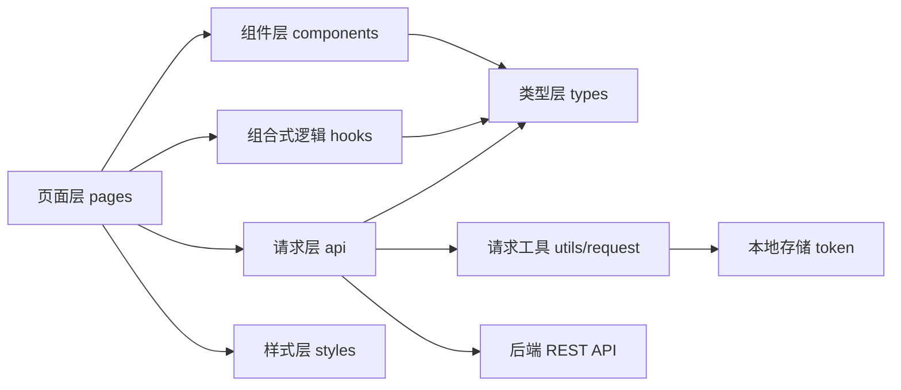
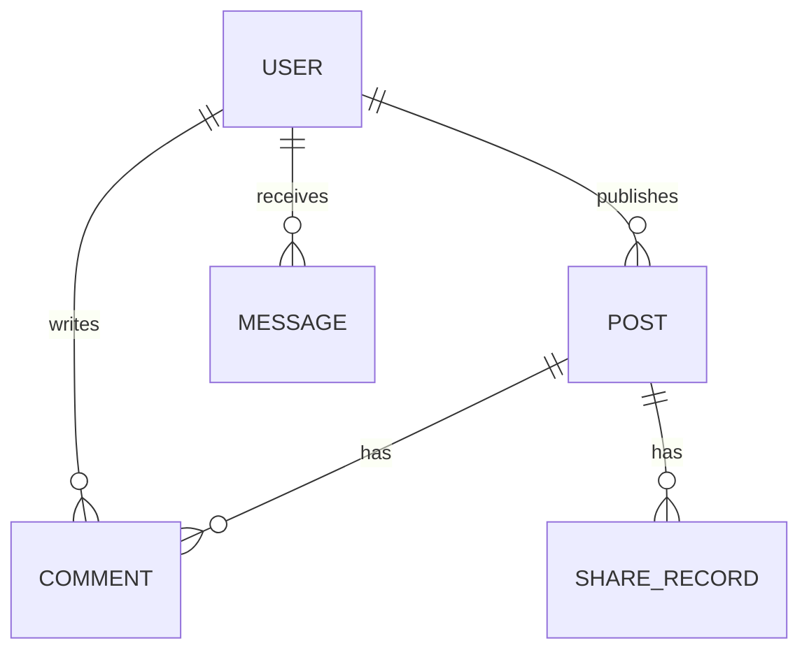

## 1. 架构设计
前端采用 `uni-app + Vue3 + TypeScript + Vite` 单体应用结构，按页面、组件、类型、请求层与工具层拆分。首期使用本地死数据驱动页面渲染，并保留与后端接口一致的类型与请求封装，保证后续平滑切换到真实接口。



## 2. 技术说明
- 前端：`uni-app + Vue3 + TypeScript + Vite`
- UI：`uview-unix`
- 运行端：H5、小程序
- 状态策略：以页面本地状态与简单存储为主，登录态通过 `uni.setStorageSync` 管理
- 数据策略：首版使用 `src/api/mock` 中的死数据；请求层保留真实接口路径和请求头逻辑
- 样式策略：`scss` + 全局设计变量，页面级样式与组件样式分离

## 3. 路由定义
| 路由 | 用途 |
|------|------|
| `/pages/home/index` | 首页内容流 |
| `/pages/profile/index` | 我的页 / 个人中心 |
| `/pages/login/index` | 登录页 |
| `/pages/publish/index` | 发布页 |
| `/pages/post-detail/index` | 内容详情页 |
| `/pages/post-edit/index` | 内容编辑页 |
| `/pages/edit-profile/index` | 编辑资料页 |
| `/pages/bind-phone/index` | 绑定手机号页 |
| `/pages/my-posts/index` | 我的发布 |
| `/pages/my-likes/index` | 我的点赞 |
| `/pages/my-comments/index` | 我的评论 |
| `/pages/my-shares/index` | 我的分享 |
| `/pages/messages/index` | 消息列表 |
| `/pages/privacy/index` | 隐私协议 |
| `/pages/user-agreement/index` | 用户协议 |

## 4. API 定义
### 4.1 认证相关
```ts
type LoginResponse = {
  token: string
  user: UserProfile
}

type UserProfile = {
  userId: string
  nickname: string
  avatar: string
  bio?: string
  phone?: string
  hasBoundPhone: boolean
}
```

### 4.2 内容相关
```ts
type PostItem = {
  id: string
  postId: string
  userId: string
  nickname: string
  avatar: string
  content: string
  images: string[]
  likeCount: number
  commentCount: number
  shareCount: number
  isLiked: boolean
  isOwner: boolean
  canEdit: boolean
  canDelete: boolean
  createdAt: string
}

type CommentItem = {
  id: string
  postId: string
  userId: string
  nickname: string
  avatar: string
  content: string
  createdAt: string
  parentId?: string
  replyToUserId?: string
}

type MessageItem = {
  id: string
  type: "like" | "comment" | "reply" | "system"
  title: string
  content: string
  isRead: boolean
  createdAt: string
}
```

### 4.3 REST 接口约定
| 方法 | 路径 | 说明 | 鉴权 |
|------|------|------|------|
| `POST` | `/api/auth/wx-login` | 小程序 `code` 换取 `token` 与用户信息 | 否 |
| `GET` | `/api/posts?page=1&pageSize=10` | 首页列表，可选登录态 | 可选 |
| `GET` | `/api/posts/{post_id}` | 内容详情，已登录返回个性化字段 | 可选 |
| `POST` | `/api/posts` | 发布内容 | 是 |
| `PUT` | `/api/posts/{post_id}` | 编辑内容，仅作者可操作 | 是 |
| `DELETE` | `/api/posts/{post_id}` | 删除内容，仅作者可操作 | 是 |
| `POST` | `/api/posts/{post_id}/like` | 点赞内容 | 是 |
| `POST` | `/api/posts/{post_id}/comments` | 发表评论或回复评论 | 是 |
| `POST` | `/api/posts/{post_id}/share` | 分享内容 | 可选 / 登录可记录用户 |
| `GET` | `/api/messages?page=1&pageSize=20` | 获取消息列表 | 是 |
| `GET` | `/api/user/posts` | 获取我的发布 | 是 |
| `GET` | `/api/user/likes` | 获取我的点赞 | 是 |
| `GET` | `/api/user/comments` | 获取我的评论 | 是 |
| `GET` | `/api/user/shares` | 获取我的分享 | 是 |

### 4.4 请求与鉴权约束
- 需要登录的请求统一携带 `Authorization: Bearer <token>`。
- `post_id` 一律表示内容 ID，不表示用户 ID。
- “我的”相关接口不传 `user_id`，由后端从 `token` 中识别当前用户。
- 首版请求层提供 `mock` 与 `real` 两种模式，默认使用 `mock`。

## 5. 前端目录规划
| 目录 | 职责 |
|------|------|
| `src/api` | 接口封装、mock 数据、资源访问 |
| `src/hooks` | 登录态、页面数据等组合式逻辑 |
| `src/utils` | 请求封装、路由跳转、存储、格式化工具 |
| `src/pages` | 页面实现 |
| `src/components` | 通用 UI 组件，如内容卡片、空状态、分组入口 |
| `src/types` | 全局类型定义 |
| `src/styles` | 主题变量、全局样式、通用布局类 |

## 6. 数据模型
### 6.1 前端视图模型


### 6.2 本地演示数据约束
- 首页至少提供 6 条 `PostItem` 死数据，覆盖有图/无图、本人内容/他人内容、已点赞/未点赞场景。
- 消息列表至少提供 6 条数据，覆盖点赞、评论、回复、系统消息。
- 我的发布、我的点赞、我的评论、我的分享从同一批基础数据派生，减少演示数据维护成本。
- 协议页面先以内置静态文案实现，后续可替换为 CMS 或后端返回内容。

## 7. 实施说明
- 第一步初始化项目骨架并配置 `pages.json`、`manifest`、`tabBar`。
- 第二步补充全局主题、通用卡片组件、空状态组件与导航工具。
- 第三步完成首页、个人中心与详情页等核心页面，并接入死数据。
- 第四步实现登录态占位、我的相关页面、消息列表与协议页面。
- 第五步封装真实接口调用方式，保留 mock 切换能力，便于后续联调。
